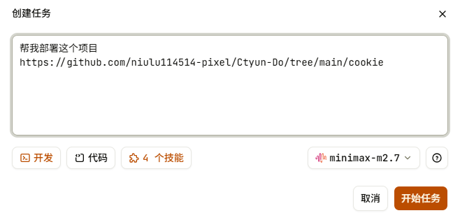
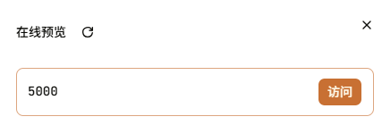
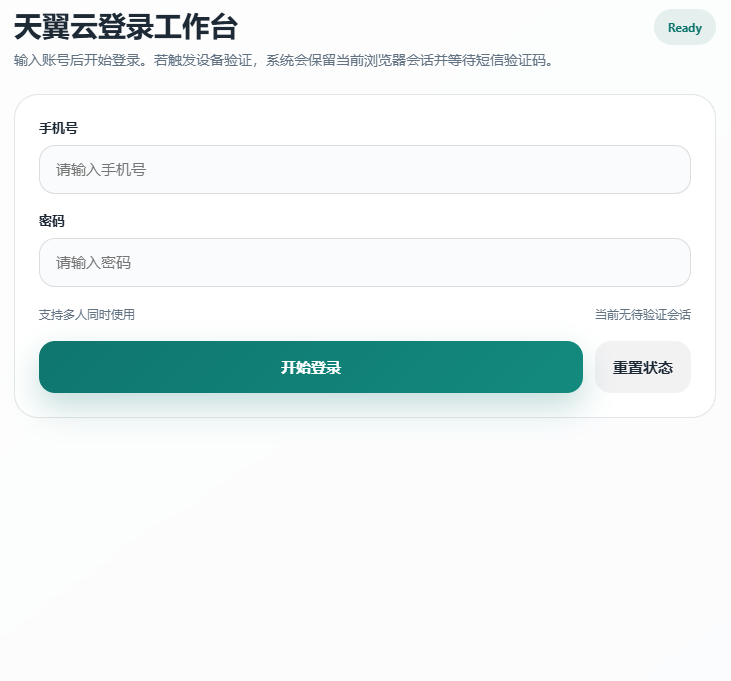
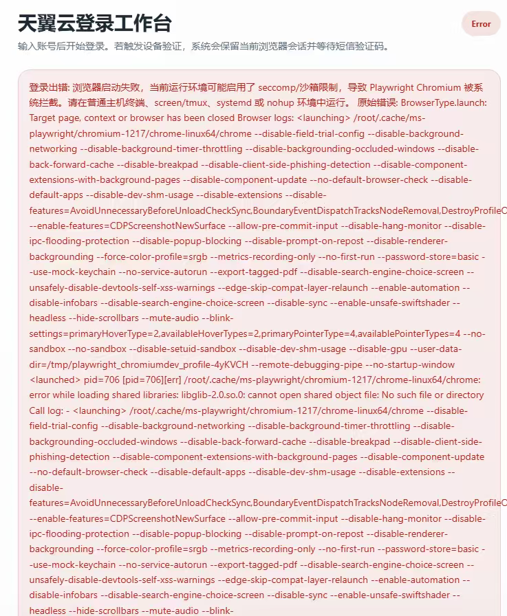
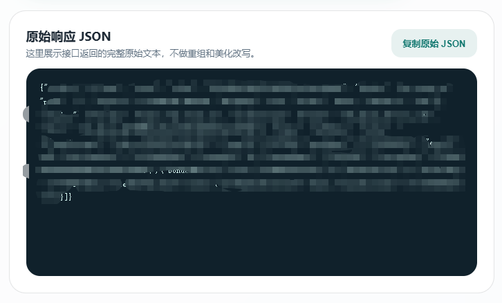
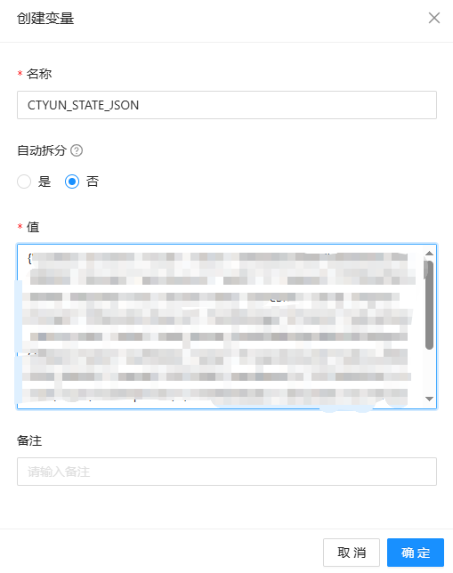

# 青龙版本使用教程

首先需要有 **MonkeyCode**账号。  
没有账号，可以走我的邀请链接，我赚点积分：  
[https://monkeycode-ai.com/?ic=019d3d57-ce0a-7927-9b88-2e0e760b5741](https://monkeycode-ai.com/?ic=019d3d57-ce0a-7927-9b88-2e0e760b5741)

---

## 操作步骤

### 1. 创建任务
在 MonkeyCode 中创建一个新任务（参考图1），告诉 AI 帮你部署项目。



发送指令：
```

帮我部署这个项目
https://github.com/niulu114514-pixel/Ctyun-Do/tree/main/cookie

```

> 💡 如果不想自己部署，或者觉得麻烦，可以直接使用我已经部署好的地址：http://66.235.105.133:5000/

### 2. 等待部署并访问
部署完成后（参考图2），点击 **访问** 按钮。



### 3. 登录与验证
进入登录页面（参考图3），输入你自己的账号和密码，项目会自动处理。最后按提示输入验证码即可。



> ⚠️ 如果出现类似图4的错误，**直接把错误信息复制下来发给 AI**。



### 4. 获取 JSON 数据
登录成功后，你应该能看到一串 JSON 数据（参考图5）。

**🔥 重要：点击复制原始JSON或者选择复制，一个字都不能少，一个字符都不能漏！**



---

## 青龙面板配置

拿到 JSON 数据后，登录你的青龙面板，上传脚本并创建任务（此处不作详述）。

### 环境变量设置（参考图6）
- **变量名称**：`CTYUN_STATE_JSON`
- **变量值**：粘贴刚才复制的 **全部 JSON 数据**



---

> 至此配置完成，脚本会自动读取环境变量运行。